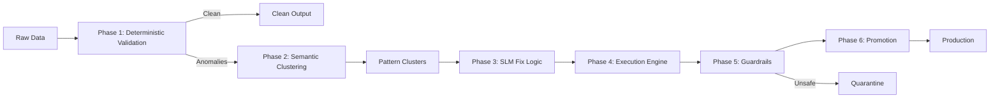

# Project Nova

<p align="center">
  
</p>

<p align="center">
  
</p>

<p align="center">
  
  
  
  
</p>

## What is Project Nova?

Project Nova is an **AI-assisted data observability pipeline** designed to safely handle bad records in ETL and data migration workflows.

Core idea:
- Let 99% clean data move through a fast lane.
- Isolate the 1% problematic rows.
- Cluster similar anomaly patterns.
- Use AI to generate **fix logic**, not direct blind edits.
- Apply fixes with guardrails, audit logs, and reversible workflows.

## 📄 Research Report & System Architecture

This repository includes a detailed technical research report that outlines the complete architecture and vision behind **Project Nova**. 

**Key highlights of the report:**
- The core concept of AI-assisted Data Observability and anomaly remediation in ETL pipelines.
- Implementation of semantic anomaly clustering using vector embeddings to compress large volumes of data errors into actionable patterns.
- Use of air-gapped Small Language Models (SLMs) to generate deterministic data transformation rules without exposing sensitive data to external APIs.
- How AI is integrated with deterministic validation layers to detect, cluster, and safely remediate data anomalies in modern data pipelines

[👉 Click here to read the full Technical Research Report](https://docs.google.com/document/d/1cKEBZS5nA8fz5g_W1S8T49I5LjeO96xW/edit?usp=drivesdk&ouid=117337334576397276483&rtpof=true&sd=true)

## Why this project exists

Traditional ETL tools are good at data movement, but weak at semantic anomaly understanding. This creates three major problems:
- High manual effort for recurring SQL/script-based fixes.
- Throughput issues when anomaly volume spikes.
- Compliance risk when sensitive data is sent to external LLM APIs.

Project Nova addresses this with a **local-first, explainable, replay-safe remediation architecture**.

## End-to-End Flow (Simple Language)

1. **Phase 1 - Ingestion (Deterministic Checks)**
   - Read raw data.
   - Run schema and rule-based validation.
   - Split into clean rows and anomaly rows.
2. **Phase 2 - Semantic Clustering (Implemented)**
   - Convert anomaly rows into text and generate embeddings.
   - Group semantically similar anomalies into clusters.
   - Persist vectors in ChromaDB.
   - Reuse pattern cache to detect repeated anomaly signatures.
3. **Phase 3 - SLM Remediation (Scaffold)**
   - Send cluster samples to the local model.
   - Generate safe, structured transformation logic.
4. **Phase 4 - Execution Engine (Scaffold)**
   - Apply approved transformation logic at scale.
5. **Phase 5 - Guardrails (Scaffold)**
   - Enforce confidence checks, risk routing, and quarantine policies.
6. **Phase 6 - Promotion (Scaffold)**
   - Promote validated staging data to production.

## Architecture Diagram



## Current Implementation Status

| Area | Status | Notes |
|---|---|---|
| Pipeline Orchestrator (`main.py`) | Done | Safe module imports + sequential phase execution |
| Phase 1 Ingestion | Scaffold | Interface/docstring ready, logic pending |
| Phase 2 Clustering | Working | Embeddings + cosine clustering + Chroma persistence |
| Phase 3 SLM Remediation | Scaffold | `run(context)` placeholder |
| Phase 4 Execution | Scaffold | Structure only |
| Phase 5 Guardrails | Scaffold | `run(context)` placeholder |
| Phase 6 Promotion | Scaffold | `run(context)` placeholder |
| UI + Tests + Docs | Scaffold-heavy | Base structure ready for expansion |

## Repository Layout

```text
project_nova/
|- main.py
|- config.py
|- data/
|- docs/
|- logs/
|- phases/
|- prompts/
|- tests/
|- ui/
`- utils/
```

## Quick Start

```bash
# 1) Create environment
python -m venv .venv

# 2) Activate (Windows PowerShell)
.venv\Scripts\Activate.ps1

# 3) Install dependencies (minimum expected)
pip install polars chromadb sentence-transformers

# 4) Run pipeline
python main.py
```

## Expected Run Behavior

- The pipeline starts and runs each phase in sequence.
- Implemented phases update the shared `context` object.
- Scaffold phases currently set phase status keys (for example, `phase3_status = "placeholder"`).
- Phase 2 processes anomaly files from `data/anomalies/`.

## Design Principles

- **Decoupled pipeline**: anomaly processing should not block ingestion throughput.
- **Air-gapped first mindset**: prioritize local inference for data sovereignty.
- **Auditability**: every remediation decision should be traceable.
- **Reversibility**: unsafe outputs should be quarantined and replay-safe.

## Roadmap (Practical Next Steps)

- Implement Phase 1 deterministic validator with schema diff + clean/anomaly split.
- Complete Phase 3 prompt-constrained SLM output schema.
- Implement Phase 4 safe transformation executor with rollback metadata.
- Add Phase 5 confidence thresholds + circuit breaker + quarantine flow.
- Add Phase 6 staging tests + production promotion checks.
- Add unit/integration tests around phase-to-phase context contracts.
