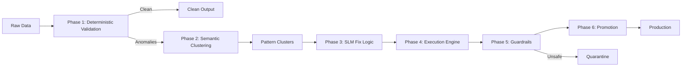

# Project Nova

<p align="center">
  
</p>

<p align="center">
  
</p>

<p align="center">
  
  
  
  
</p>

<p align="center">
  <strong>Deterministic ingestion, semantic anomaly clustering, local SLM remediation, and execution staging for ETL data quality workflows.</strong>
</p>

<p align="center">
  Built to detect recurring anomaly patterns, compress them into actionable clusters, and generate structured remediation logic without relying on external cloud LLMs.
</p>

## What is Project Nova?

Project Nova is an **AI-assisted data observability** and anomaly remediation pipeline designed to safely detect, cluster, and correct problematic records in ETL and data migration workflows.

Core idea:
- Let 99% clean data move through a fast lane.
- Isolate the 1% problematic rows.
- Cluster similar anomaly patterns.
- Use AI to generate deterministic transformation rules, not direct blind edits on the data.
- Apply fixes with guardrails, audit logs, and reversible workflows.

## Current Snapshot

- Phase 1 is working with deterministic ingestion, schema-aware validation, duplicate checks, and anomaly shaping for downstream clustering.
- Phase 2 is working end-to-end with embeddings, semantic grouping, pattern reuse, and Chroma persistence.
- Phase 3 is working with local Ollama inference, hybrid retrieval, structured remediation output, and remediation memory write-back.
- Phase 4 is working as a safe execution staging layer with remediation contract checks, sandboxed lambda validation, staged row transforms, and audit artifacts.
- The current repo can run combined validation flows across Phase 1 -> 2 and Phase 2 -> 3 -> 4.
- Phase 5 and Phase 6 are still under active development.

## Why This Is Interesting

- Instead of fixing anomalies row-by-row, Project Nova clusters similar failures into reusable anomaly families.
- Instead of letting a model edit data directly, it generates structured transformation logic with confidence and audit context.
- Instead of depending on hosted LLM APIs, the current remediation path is aligned to a local-first Ollama workflow.
- Instead of treating retrieval as prompt stuffing, the system persists cluster and remediation memory for future reuse.

## 📄 Research Report & System Architecture

This repository includes a detailed technical research report that outlines the complete architecture and vision behind **Project Nova**. 

**Key highlights of the report:**
- The core concept of AI-assisted Data Observability and anomaly remediation in ETL pipelines.
- Implementation of semantic anomaly clustering using vector embeddings to compress large volumes of data errors into actionable patterns.
- Use of air-gapped Small Language Models (SLMs) to generate deterministic data transformation rules without exposing sensitive data to external APIs.
- How AI is integrated with deterministic validation layers to detect, cluster, and safely remediate data anomalies in modern data pipelines.

[👉 Click here to read the full Technical Research Report](https://docs.google.com/document/d/1cKEBZS5nA8fz5g_W1S8T49I5LjeO96xW/edit?usp=drivesdk&ouid=117337334576397276483&rtpof=true&sd=true)

## Why this project exists

Traditional ETL tools are optimized for data movement but lack semantic understanding of anomalies. When malformed records appear, pipelines either fail or propagate corrupted data downstream. This often forces engineers to manually write SQL or scripts for every recurring issue. This creates three major problems:
- High manual effort for recurring SQL/script-based fixes.
- Throughput issues when anomaly volume spikes.
- Compliance risk when sensitive data is sent to external LLM APIs.

Project Nova addresses this with a **local-first, semantic clustering and explainable remediation architecture** designed to detect anomaly patterns and safely generate transformation logic.

## End-to-End Flow (Simple Language)

1. **Phase 1 - Ingestion (Working)**
   - Read raw input from local JSON, JSONL, or CSV sources.
   - Apply deterministic validation for required fields, typed columns, and duplicate checks.
   - Split data into clean rows and anomaly rows.
   - Emit downstream-safe anomaly records for Phase 2.
2. **Phase 2 - Semantic Clustering (Working)**
   - Convert anomaly rows into text and generate embeddings.
   - Group semantically similar anomalies into clusters.
   - Persist raw embeddings and cluster memory in ChromaDB.
   - Reuse pattern cache to detect repeated anomaly signatures.
   - Store durable cluster metadata for retrieval-aware remediation.
3. **Phase 3 - SLM Remediation (Working)**
   - Normalize Phase 2 clusters into retrieval-aware remediation inputs.
   - Retrieve rule context from static prompts plus Chroma-backed cluster/remediation memory.
   - Send cluster context to a local Ollama SLM.
   - Generate structured transformation logic with confidence, guardrail metadata, and audit-ready outputs.
4. **Phase 4 - Execution Engine (Working)**
   - Validate Phase 3 remediation contracts before staging execution.
   - Safely compile and apply approved remediation lambdas to anomaly-linked rows.
   - Split staged and quarantined remediations.
   - Persist audit-friendly execution artifacts for downstream guardrails.
5. **Phase 5 - Guardrails (Scaffold)**
   - Enforce confidence checks, risk routing, and quarantine policies.
6. **Phase 6 - Promotion (Scaffold)**
   - Promote validated staging data to production.

## Architecture Diagram



## Current Implementation Status

| Area | Status | Notes |
|---|---|---|
| Pipeline Orchestrator (`main.py`) | Done | Safe module imports + sequential phase execution |
| Phase 1 Ingestion | Working | Deterministic validation, schema-aware rules, duplicate checks, and anomaly shaping |
| Phase 2 Clustering | Working | Embeddings, semantic grouping, Chroma persistence, and durable cluster memory |
| Phase 3 SLM Remediation | Working | Local Ollama provider, hybrid retrieval, remediation memory write-back, and audited outputs |
| Phase 4 Execution | Working | Contract validation, safe lambda staging, quarantining, and execution artifacts |
| Phase 5 Guardrails | Scaffold | `run(context)` placeholder |
| Phase 6 Promotion | Scaffold | `run(context)` placeholder |
| UI + Tests + Docs | In Progress | Validation runners and unit tests are available through Phase 4 |

## What Works Today

- Deterministic ingestion with required-field checks, schema hints, and duplicate detection.
- Semantic clustering of anomaly rows into compact pattern groups.
- Chroma-backed storage for embeddings, cluster memory, and remediation memory.
- Retrieval-aware Phase 3 prompting using static rules plus persisted memory.
- Local Ollama-based remediation generation with structured JSON output.
- Confidence and guardrail-ready metadata in Phase 3 outputs.
- Safe Phase 4 execution staging with sandboxed lambda validation and staged row transforms.
- Local validation through unit tests and combined debug runners up to Phase 4.

## Repository Layout

```text
project_nova/
|- main.py
|- config.py
|- data/
|- docs/
|- logs/
|- phases/
|- prompts/
|- tests/
|- ui/
`- utils/
```

## Quick Start

```bash
# 1) Create environment
python -m venv .venv

# 2) Activate (Windows PowerShell)
.venv\Scripts\Activate.ps1

# 3) Install project dependencies
pip install -r requirements.txt

# 4) Start Ollama and ensure your local model is available
ollama serve
ollama pull llama3.1:8b

# 5) Configure Phase 3 for local SLM
# .env
PHASE3_PROVIDER=ollama
OLLAMA_MODEL=llama3.1:8b
OLLAMA_URL=http://127.0.0.1:11434

# 6) Run pipeline
python main.py
```

## Expected Run Behavior

- The pipeline starts and runs each phase in sequence.
- Implemented phases update the shared `context` object.
- Phase 1 reads local input data, applies deterministic validation, and emits clean rows plus anomaly rows.
- Phase 2 groups anomalies into semantic clusters and persists retrieval memory to ChromaDB.
- Phase 3 consumes Phase 2 clusters and produces structured remediation suggestions using a local Ollama model.
- Phase 4 validates and stages remediation logic against anomaly-linked rows, then writes execution artifacts for downstream guardrails.
- Scaffold phases still exist for Phase 5 and 6.

## Local Validation

```bash
# Unit validation for Phase 1
pytest tests/test_ingestion.py -q

# Unit validation for Phase 3
pytest tests/test_phase3_slm_remediation.py -q

# Unit validation for Phase 4
pytest tests/test_phase4_execution.py -q

# Combined Phase 1 -> Phase 2 integration run
python tests/debug_phase12_runner.py

# Combined Phase 2 -> Phase 3 integration run
python tests/debug_phase23_runner.py
```

Expected current result:
- Phase 1 emits deterministic anomaly records in a format Phase 2 can consume.
- Phase 2 forms anomaly clusters from the sample dataset.
- Phase 3 returns structured remediations for those clusters.
- Phase 4 stages valid remediations, quarantines unsafe ones, and writes an execution artifact.
- The local provider path should show `ollama/<model-name>` in the output summary.

Example validation summary:

```text
Phase 1: 5 rows -> 1 clean, 4 anomalies
Phase 2: 4 anomalies -> 1 cluster
Phase 3: 4 remediations, provider=ollama
Phase 4: staged=3, quarantined=1, applied_rows=12
```

## Design Principles

- **Decoupled pipeline**: anomaly processing should not block ingestion throughput.
- **Air-gapped AI architecture**: anomaly remediation logic is generated using local models to avoid sending sensitive enterprise data to external APIs.
- **Auditability**: every remediation decision should be traceable.
- **Reversibility**: unsafe outputs should be quarantined and replay-safe.

## Roadmap (Practical Next Steps)

- Add Phase 5 confidence thresholds + circuit breaker + quarantine flow.
- Add Phase 6 staging tests + production promotion checks.
- Add unit/integration tests around phase-to-phase context contracts.
